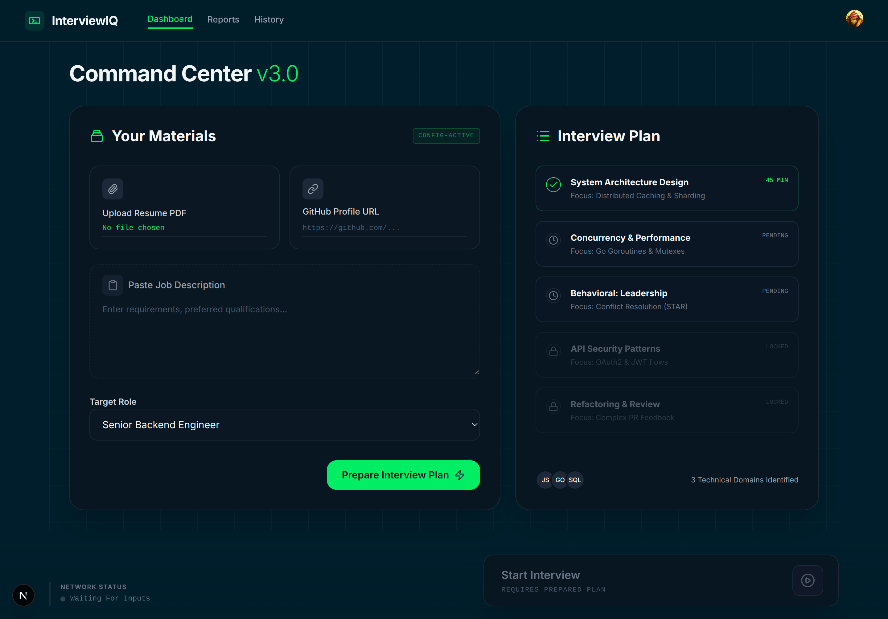

# <p align="center">BrainCircuit InterviewIQ</p>

<p align="center">
  <strong>One interviewer. Unlimited potential.</strong>
</p>

<p align="center">
  
</p>

---

## 🚀 Overview

**InterviewIQ** is an agentic AI-powered mock interview platform designed to bridge the gap between candidate preparation and real-world interviewer expectations. Unlike static Q&A tools, InterviewIQ features an autonomous AI agent that thinks, adapts, and probes deeper based on your unique profile and real-time responses.

Build your confidence by mastering **Behavioral**, **Technical**, and **System Design** rounds with an AI that interviews just like a real Engineering Manager.

## 🎯 The Challenge: Hackathon Problem Statement
### The Solution
We built an agentic platform that autonomously conducts end-to-end mock interviews tailored to a candidate's target role, experience level, and resume. Our AI agent goes beyond scripts; it detects weak answers, probes deeper into technical trade-offs, and provides structured, actionable feedback.

---

## 🧠 The Agentic Workflow

InterviewIQ demonstrates sophisticated agentic behavior across the entire interview lifecycle:

- **Pre-Interview (Ingestion)**: Autonomously parses resumes and GitHub repositories to extract architectural skeletons and skill sets, generating a 100% personalized interview plan.
- **During Interview (Adaptive Logic)**: The agent doesn't just ask questions — it listens and adapts. It can interrupt, ask follow-up questions on technical deep-dives, and transition naturally between rounds.
- **Post-Interview (Intelligent Synthesis)**: Delivers a comprehensive executive report featuring radar charts, communication analysis, knowledge depth scoring, and a personalized roadmap for improvement.

---

## ✨ Core Features

| Phase | Feature | Description |
| :--- | :--- | :--- |
| **Ingestion** | **Resume & GitHub Parsing** | Extracts your actual experience to avoid generic "Google" style questions. |
| **Preparation** | **Custom Interview Plans** | Generates specific modules for System Design, Coding, and Leadership. |
| **Live Agent** | **Dynamic Questioning** | Agent probes for "Why?" and "Trade-offs" instead of just "What?". |
| **Analytics** | **Deep-Dive Feedback** | Actionable metrics on confidence, technical depth, and communication. |
| **Experience** | **Premium UI/UX** | Stunning MongoDB-inspired dark mode with smooth Framer Motion animations. |

---

## 🖼️ Screenshots

### The Command Center
*Upload your materials and watch the agent generate your custom interview plan.*


### Landing Page
*A high-performance gateway to your interview preparation.*


## 🛠️ Tech Stack

- **Core Framework**: [Next.js 15](https://nextjs.org/) (App Router)
- **Styling**: [Tailwind CSS 4](https://tailwindcss.com/) with a MongoDB-inspired design system
- **Authentication**: [Clerk](https://clerk.com/) (GitHub & Google OAuth)
- **Database**: [Neon](https://neon.tech/) (Serverless PostgreSQL)
- **ORM**: [Prisma](https://www.prisma.io/)
- **Animations**: [Framer Motion](https://www.framer.com/motion/)
- **Icons**: [Lucide React](https://lucide.dev/)

---

## 🚀 Getting Started

### Prerequisites
- Node.js 18+ 
- A Neon PostgreSQL database
- Clerk API keys

### Installation

1. **Clone the repository**
   ```bash
   git clone https://github.com/your-username/interviewiq.git
   cd interviewiq
   ```

2. **Install dependencies**
   ```bash
   npm install
   ```

3. **Environment Setup**
   Create a `.env` file in the root:
   ```env
   DATABASE_URL="your_neon_db_url"
   NEXT_PUBLIC_CLERK_PUBLISHABLE_KEY=...
   CLERK_SECRET_KEY=...
   ```

4. **Run the Development Server**
   ```bash
   npm run dev
   ```

Open [http://localhost:3000](http://localhost:3000) to start your first mock interview.

---

## 📁 Project Structure

```
interviewiq/
├── app/               # Next.js App Router (Dashboard, Interview, Reports)
├── components/        # Reusable UI components (Navbar, Bento-grid)
├── prisma/            # Schema and database migrations
├── public/            # Static assets and screenshots
├── lib/               # Utility functions and database clients
└── _prd/             # Detailed architectural documentation
```

---

## 👥 Team: Code Red

- **Rudra Agrawal** — Team Lead
- **Priyanshu Singh**
- **Arpit Gupta**
- **Deepanshu Khatri**

## Learn More

*For detailed implementation specs, refer to the [`_prd/`](./_prd/) directory.*
